# Prueba Técnica: Senior QA Engineer (LogiTrack)

**Cómo leer este documento.** Cada punto empieza con *"Qué piden"* (resumen del enunciado) y luego la respuesta.
Todo el código mostrado se ejecutó de verdad y las capturas son de esas ejecuciones. Como LogiTrack es una empresa
ficticia, construí una **versión simulada pequeña de su API y de su pantalla de login**, solo para que las pruebas
tuvieran algo real contra qué ejecutarse.

# Parte 1. Estrategia de calidad y factibilidad de automatización (20 puntos)

## 1.1 Estrategia de pruebas para el flujo principal (8 puntos)

*Qué piden: una tabla con 5 niveles de prueba (qué validan, herramientas y riesgos que cubren), qué pruebas correr en
cada etapa del pipeline y por qué cuestan lo que cuestan.*

**Idea principal: la "pirámide de pruebas".** Muchas pruebas pequeñas, rápidas y baratas en la base; pocas pruebas
grandes, lentas y caras arriba. Y probar **lo antes posible**, porque un error encontrado mientras se programa cuesta
minutos, y el mismo error encontrado en el almacén cuesta pedidos perdidos.

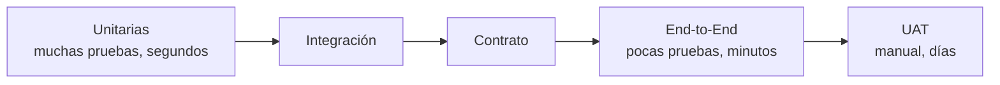

| Nivel de prueba | Qué valida | Herramientas | Riesgos que cubre |
|---|---|---|---|
| **Unit Tests** (unitarias) | Cada regla de negocio por separado: solo se asignan pedidos con stock, un pedido no puede tener dos operadores, solo supervisores asignan, cálculo de la guía | pytest (Python), `flutter test` (app), Jest (web Angular) | Pedidos sin stock que avanzan; reglas mal programadas. Se detectan en segundos |
| **Integration Tests** (integración) | La API trabajando con sus piezas reales o simuladas: base de datos, cola de mensajes Pub/Sub, Firestore | pytest + base de datos en contenedor + emuladores de Pub/Sub y Firestore de Google | **Asignaciones duplicadas** (dos personas asignando a la vez), mensajes perdidos entre servicios, tablero que no se actualiza |
| **Contract Tests** (contrato) | Que el formato acordado entre dos sistemas no cambie sin aviso (por ejemplo, los campos que la app espera recibir) | Pact o JSON Schema | Una actualización de la API que rompe la app ya instalada en los celulares |
| **End-to-End Tests** (de punta a punta) | El flujo completo como lo vive el usuario: pedido → reserva de stock → asignación → escaneo → guía | Playwright (web), Appium (app móvil) | **Errores intermitentes al escanear**, fallas entre servicios, tablero que no refleja el estado real |
| **UAT** (aceptación de usuario) | Que supervisores y operadores reales confirmen que la solución sirve para su trabajo, con escáneres físicos | Guiones de prueba manuales en el ambiente de pruebas | Usabilidad en el almacén (guantes, poca luz), reglas mal entendidas, hardware real |

**¿Qué pruebas corro en cada etapa del pipeline?**

| Etapa | Qué se ejecuta | Tiempo | Por qué (tiempo y costo) |
|---|---|---|---|
| **Pull Request** (alguien propone un cambio) | Revisión de estilo, análisis de seguridad del código, unitarias, contrato | menos de 10 min | Ocurre muchas veces al día; debe ser rápido y barato |
| **Merge a main** (el cambio fue aprobado) | Lo anterior + integración, API, seguridad, pruebas web, prueba corta de rendimiento | menos de 25 min | Se verifica todo junto una vez por cambio; necesita un ambiente de pruebas |
| **Release Candidate** (versión candidata a salir) | Regresión completa web y móvil en varios celulares, rendimiento completo, seguridad completa, UAT | 2 a 4 horas + 1 o 2 días de UAT | Es la última barrera antes del cliente; lo más caro se hace aquí, una vez por versión |
| **Producción** | Pruebas de humo (verifican en pocos minutos que lo esencial funciona: login, consultar y asignar un pedido), salida gradual a pocos usuarios, monitoreo automático | 5 a 15 min | Detecta lo que solo pasa con datos y tráfico reales |

Costo aproximado de cada nivel frente a una prueba unitaria: integración 5 veces más, End-to-End web 20 veces,
End-to-End móvil 40 veces y UAT 100 veces (son horas de personas). Por eso la meta es más o menos 70% unitarias,
20% integración, contrato y API, y 10% End-to-End.

## 1.2 Factibilidad de automatización de PickApp (7 puntos)

*Qué piden: tabla con los 9 módulos indicando si se puede automatizar, complejidad, limitaciones y prioridad,
justificando por el escáner físico y por estar hecha en Flutter.*

**Las dos limitaciones que mandan:**
- **Flutter** dibuja la pantalla por su cuenta, así que las herramientas de automatización no "ven" los botones,
  a menos que el desarrollador les ponga una etiqueta de identificación (`Semantics`). Es como ponerle un código de
  barras a cada botón para que el robot lo encuentre.
- **El escáner físico** no existe en un emulador. Pero los escáneres de almacén funcionan como un **teclado**:
  "escriben" el código y presionan Enter. Eso **sí** se puede simular. Lo que no se puede simular es la lectura
  óptica real (códigos dañados, reflejos).

| Módulo | ¿Automatizable? | Complejidad | Limitaciones técnicas | Prioridad |
|---|---|---|---|---|
| 1. Pedidos Asignados | Sí | Baja | Hay que preparar los pedidos de prueba antes por la API | **Alta**: es la entrada al flujo principal |
| 2. Preparación de Pedido | Parcial | Alta | El escaneo se simula escribiendo el código; la lectura óptica real es manual | **Alta**: es donde están los errores de escaneo |
| 3. Despacho | Parcial | Media | La guía se valida por API y pantalla; la impresión física de la etiqueta no | **Alta** |
| 4. Gestión de Usuarios | Sí | Baja | Conviene probarla casi toda por API y dejar 1 o 2 casos en pantalla | Media |
| 5. Gestión de Insumos | Sí | Baja | Pantallas simples de crear/editar; poco riesgo para el negocio | Baja |
| 6. Dashboards | Parcial | Media | Los números se validan por API; los gráficos dibujados no se leen bien con Appium | Media |
| 7. Alertas y Notificaciones | Parcial | Alta | Las notificaciones del celular dependen del sistema operativo y de servicios externos | Media |
| 8. Login / Autenticación | Sí | Baja | Si hay verificación en dos pasos, se usan usuarios de prueba sin ella | **Alta**: sin login no funciona nada |
| 9. Configuración de Impresoras | No (solo la lógica) | Alta | Bluetooth y hardware real; el emulador no tiene Bluetooth | Baja: cambia poco, se prueba a mano |

**Justificación.** Prioricé por **riesgo para el negocio, frecuencia de uso y estabilidad**: los módulos 1, 2, 3 y 8
son el trabajo diario del almacén y donde hoy aparecen los errores. Flutter no impide automatizar, pero se debe
**acordar con desarrollo** que cada elemento importante tenga su etiqueta `Semantics(identifier: ...)`.

## 1.3 Métricas de calidad (5 puntos)

*Qué piden: fórmula, meta y frecuencia de Defect Leakage, Test Coverage, Change Failure Rate, MTTR y 2 métricas más.*

| Métrica | Qué significa | Fórmula | Meta | Frecuencia |
|---|---|---|---|---|
| **Defect Leakage** (fuga de defectos) | Cuántos errores se nos escaparon a producción | errores en producción ÷ errores totales × 100 | menos de 5% | Cada versión |
| **Test Coverage** (cobertura) | Qué parte del código ejecutan las pruebas | líneas probadas ÷ líneas totales × 100 | 80% o más (90% en código nuevo) | Cada cambio |
| **Change Failure Rate** (tasa de cambios fallidos) | Qué porcentaje de despliegues causó un problema | despliegues con problema ÷ despliegues totales × 100 | menos de 15% | Semanal |
| **MTTR** (tiempo medio de recuperación) | Cuánto tardamos en arreglar el servicio cuando se cae | suma de tiempos de recuperación ÷ número de incidentes | menos de 1 hora en fallas graves | Mensual |
| **Tasa de pruebas inestables** (adicional) | Pruebas que a veces pasan y a veces fallan sin cambios en el código | ejecuciones inestables ÷ ejecuciones totales × 100 | menos de 2% | Diaria |
| **Tiempo de respuesta de la API** (adicional) | Qué tan rápido responde la asignación de pedidos | el 95% de las respuestas debe tardar menos de X | menos de 500 milisegundos | Continua (monitoreo) |

# Parte 2. Diseño de casos de prueba funcionales (15 puntos)

## 2.1 Matriz de casos de prueba (10 puntos)

*Qué piden: mínimo 12 casos con ID, módulo, caso, precondiciones, pasos, resultado esperado, tipo (solo Funcional,
Negativo, Límite, Regresión o E2E) y prioridad. Incluir 3 flujos de entrega, casos negativos, casos límite y
validaciones de datos, y marcar cuáles automatizar y por qué.*

**Datos de prueba:** operador `OP-312` (contraseña `Pick2025!`); pedido a domicilio `ORD-2025-007841` con 2 productos
(`SKU-1001` código 7501234567890 y `SKU-2002` código 7501234567891); pedido para tienda `ORD-2025-007842` con 1 producto;
máximo 50 productos por pedido.

| ID | Módulo | Caso de prueba | Precondiciones | Pasos | Resultado esperado | Tipo | Prioridad |
|---|---|---|---|---|---|---|---|
| TC-01 | Preparación / Despacho | Verificar que un pedido a domicilio completo genera la guía de envío | Operador `OP-312` activo. Pedido `ORD-2025-007841` (domicilio, 2 productos) asignado a él | 1. Iniciar sesión con `OP-312`.<br>2. Abrir el pedido `ORD-2025-007841`.<br>3. Escanear el código de `SKU-1001`.<br>4. Escanear el código de `SKU-2002`.<br>5. Tocar "Confirmar preparación" | Cada producto cambia de "Pendiente" a "Escaneado" y el contador pasa a 2/2. Al confirmar se muestra "Guía Generada" con su número (`GUIA-2025-007841`) y el estado del pedido cambia a "Guía Generada" | E2E | Alta |
| TC-02 | Preparación / Despacho | Verificar que un pedido de recogida en tienda queda "Listo para recoger" | Pedido `ORD-2025-007842` (recogida en tienda, 1 producto) asignado a `OP-312` | 1. Iniciar sesión.<br>2. Abrir el pedido `ORD-2025-007842`.<br>3. Escanear su único producto.<br>4. Tocar "Confirmar preparación" | El estado cambia a "Listo para recoger". **No** se genera guía de envío. El pedido sale de la lista de pendientes del operador | E2E | Alta |
| TC-03 | Preparación | Verificar el rechazo de un pedido por producto no disponible | Pedido asignado con un producto sin existencias en el almacén | 1. Abrir el pedido.<br>2. Tocar "Rechazar: producto no disponible".<br>3. Seleccionar el motivo "Sin existencias".<br>4. Confirmar el rechazo | El estado cambia a "Pendiente de resurtido". El e-commerce recibe el cambio de estado. El pedido sale de la lista del operador | E2E | Alta |
| TC-04 | Login | Validar que el login rechaza credenciales inválidas | App instalada; usuario `OP-312` activo | 1. Abrir la app.<br>2. Escribir el usuario `OP-312`.<br>3. Escribir una contraseña incorrecta.<br>4. Tocar "Ingresar" | Se muestra "Credenciales inválidas". La app permanece en la pantalla de login y no muestra pedidos | Negativo | Alta |
| TC-05 | Preparación | Validar el mensaje cuando el escáner falla (lectura vacía) | Pedido `ORD-2025-007841` abierto, 0 de 2 escaneados | 1. Escanear un código dañado o sin lectura (el escáner envía un texto vacío) | Se muestra "Código vacío, vuelve a escanear". El contador sigue en 0/2 y ningún producto cambia de estado | Negativo | Alta |
| TC-06 | Preparación | Validar que no se acepta un producto que no pertenece al pedido | Pedido `ORD-2025-007841` abierto | 1. Escanear el código de un producto de otro pedido (7501234567892) | Se muestra "Producto 7501234567892 no pertenece al pedido". El contador no cambia | Negativo | Alta |
| TC-07 | Preparación | Validar el mensaje para un producto que no existe en el catálogo | Pedido abierto | 1. Digitar manualmente un código que no existe (0000000000000).<br>2. Presionar Enter | Se muestra "Producto no encontrado". El contador no cambia | Negativo | Media |
| TC-08 | Preparación | Verificar un pedido con un solo producto (límite inferior) | Pedido con 1 producto asignado | 1. Abrir el pedido.<br>2. Escanear el producto.<br>3. Confirmar | El contador muestra 1/1, el botón "Confirmar preparación" se habilita y el pedido termina en el estado que le corresponde | Límite | Alta |
| TC-09 | Preparación | Verificar un pedido con el máximo de 50 productos (límite superior) | Pedido con 50 productos creado por la API | 1. Abrir el pedido.<br>2. Desplazar la lista y escanear los 50 productos.<br>3. Confirmar | La lista se desplaza sin cortes, el contador llega a 50/50 y se genera la guía. La pantalla responde sin demoras | Límite | Media |
| TC-10 | Login / Preparación | Verificar que la sesión expirada no pierde el avance del escaneo | Sesión configurada para durar 2 minutos; pedido con 2 productos | 1. Abrir el pedido y escanear 1 producto.<br>2. Esperar a que la sesión expire.<br>3. Escanear el segundo producto | La app pide iniciar sesión de nuevo. Al volver a entrar, el pedido conserva 1/2 escaneado y permite continuar | Límite | Alta |
| TC-11 | Preparación | Validar que un producto escaneado dos veces no se cuenta doble | Pedido abierto con `SKU-1001` ya escaneado (1/2) | 1. Escanear otra vez el código de `SKU-1001` | Se muestra "Producto SKU-1001 ya fue escaneado". El contador sigue en 1/2 | Funcional | Alta |
| TC-12 | Preparación | Validar que no se puede confirmar sin escanear todos los productos | Pedido con 2 productos, solo 1 escaneado | 1. Intentar tocar "Confirmar preparación" | El botón está deshabilitado y el pedido no cambia de estado | Funcional | Alta |
| TC-13 | Rechazo | Validar que el rechazo exige seleccionar un motivo | Pedido abierto | 1. Tocar "Rechazar".<br>2. Confirmar sin seleccionar motivo | Se muestra "Selecciona un motivo". El estado del pedido no cambia | Funcional | Media |
| TC-14 | Pedidos asignados | Verificar que la lista refleja una reasignación hecha por el supervisor | Pedido asignado a `OP-312` y lista de pedidos abierta | 1. Desde el Centro de Control, reasignar el pedido a `OP-313`.<br>2. Refrescar la lista en la app de `OP-312` | El pedido desaparece de la lista de `OP-312` en menos de 5 segundos y aparece en la de `OP-313` | Regresión | Alta |

**¿Cuáles automatizar y por qué?**

| Casos | ¿Automatizar? | Por qué |
|---|---|---|
| TC-01, 02, 03 | Sí (primero) | Son los 3 flujos de entrega: el trabajo diario del almacén. Se repiten en cada versión |
| TC-04, 06, 07, 11, 12, 13 | Sí | Resultado siempre igual y fácil de verificar; protegen contra errores que ya ocurrieron |
| TC-08, 09, 10, 14 | Sí | Los datos (pedidos de 1 y de 50 productos, sesión corta, reasignación) se preparan por API |
| TC-05 | Parcial | La lectura vacía se simula; la lectura óptica real de un código dañado se prueba a mano con el escáner |

TC-01, 02, 03, 04 y 06 ya están automatizados con Appium y se ejecutaron con éxito (ver Parte 4, Ejercicio C).

## 2.2 Organización de los casos automatizables (5 puntos)

*Qué piden: cómo organizarlos en suites, cómo priorizar, qué hacer con el escáner físico y cómo integrar al equipo funcional.*

- **Suites (grupos de pruebas).** Uso **etiquetas** en cada prueba y armo grupos según la necesidad:
  `smoke` (TC-01 y TC-04, 3 minutos, en cada despliegue), `critical` (si falla, bloquea la entrega),
  `regression` (todas, cada noche) y `quarantine` (pruebas inestables en revisión).
  Ejemplo: con el comando `pytest -m smoke` se ejecutan solo las pruebas de humo.
- **Prioridad.** Primero lo de mayor **riesgo para el negocio**, lo que **más se repite**, lo que **ya no cambia** y lo
  que se puede probar al **nivel más bajo** (si una regla se prueba por API, no la pruebo por pantalla).
- **Escáner físico.** Separo la lógica del hardware: en pruebas automáticas **simulo** la lectura escribiendo el
  código y presionando Enter, como hace el escáner real. Además dejo un **grupo pequeño
  de pruebas manuales en un celular real** con el escáner del almacén en cada versión.
- **Equipo funcional.** Los casos se revisan juntos (negocio, desarrollo y QA) antes de automatizarlos, escritos en
  lenguaje de negocio. Cada error que encuentran en pruebas manuales se convierte en un caso nuevo, y cada dos
  semanas se muestra el avance para que ellos decidan qué automatizar después.

# Parte 3. Automatización y CI/CD (15 puntos)

*CI/CD = cada cambio de código se prueba (integración continua) y se despliega (entrega continua) de forma automática.*

## 3.1 Pipeline ideal (6 puntos)

*Qué piden: un diagrama con pruebas unitarias, de integración, de seguridad, de interfaz web y móvil, de humo y
"quality gates", indicando qué se ejecuta, cuánto tarda y cuándo se bloquea.*

Un **quality gate** es una **puerta de control**: si no se cumple una condición, el código no pasa a la siguiente etapa.

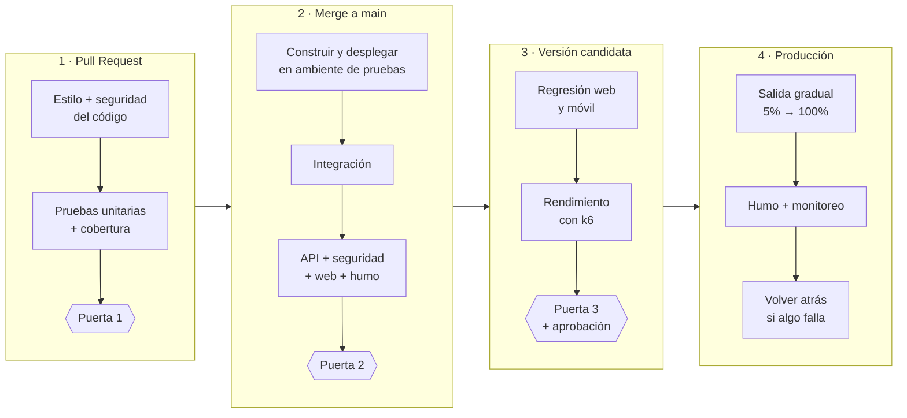

| Etapa | Qué se ejecuta | Tiempo | Pasa si... (si no, se bloquea) |
|---|---|---|---|
| Unit Tests | Pruebas unitarias | 2 a 4 min | Pasan todas y la cobertura es de 80% o más |
| Security Scans | Análisis del código (Bandit) y de librerías con vulnerabilidades conocidas (pip-audit) | 1 a 2 min | No hay hallazgos graves |
| Integration Tests | API con base de datos y mensajes | 4 a 6 min | Pasan todas |
| UI Tests web | Playwright en Chrome, Firefox y WebKit | 3 a 6 min | Ninguna prueba crítica falla |
| UI Tests móvil | Appium en varios celulares (emuladores) | 15 a 45 min | Ninguna prueba crítica falla |
| Smoke Tests | Pruebas de humo después de desplegar: verifican que lo esencial funciona (login, consultar y asignar un pedido) | 2 a 5 min | Pasan todas |
| Quality Gates | Lectura automática de los resultados | segundos | 0 pruebas críticas fallidas y al menos 95% de éxito |

## 3.2 Mecanismos para que el código defectuoso no llegue a producción (4 puntos)

*Qué piden: explicar branch protection rules, required checks, coverage gates, canary deployments y rollback automático.*

- **Branch protection rules (protección de la rama principal).** Nadie puede subir cambios directo a `main`: todo
  entra por Pull Request, con al menos 1 aprobación de otra persona. Se configura en GitHub: Settings → Branches.
- **Required checks (verificaciones obligatorias).** El botón "Merge" solo se habilita si los jobs del pipeline
  están en verde (análisis del código, unitarias, API, web).
- **Coverage gates (mínimo de cobertura).** Si las pruebas cubren menos del 80% del código, el pipeline falla.
  En el repositorio: `--cov-fail-under=80`.
- **Canary deployments (salida gradual).** La versión nueva primero recibe solo el 5% del tráfico. Si los errores y
  los tiempos están bien, sube a 25%, 50% y 100%. Cloud Run permite repartir el tráfico así. El nombre viene de los
  canarios que usaban los mineros como alarma temprana.
- **Rollback automático (volver atrás solo).** Si en la salida gradual los errores superan el 1% o la API se pone
  lenta, un proceso automático devuelve todo el tráfico a la versión anterior y avisa al equipo.

## 3.3 Ejemplo funcional del pipeline (5 puntos)

*Qué piden: un archivo de configuración completo y comentado que ejecute pruebas, genere un reporte, lo publique como
artefacto, falle si hay pruebas críticas en rojo y envíe una notificación.*

Herramienta: **GitHub Actions**. Archivo completo: `.github/workflows/ejemplo-3-3.yml`

{{archivo:.github/workflows/ejemplo-3-3.yml}}

**¿Cómo sabe el pipeline cuáles pruebas son críticas?** Cada prueba importante lleva la etiqueta `@pytest.mark.critical`.
El script `tools/quality_gate.py` lee el reporte XML y, si alguna prueba crítica falló, termina con error y el pipeline
queda en rojo. Prueba real: desactivé a propósito el control de concurrencia de la API y el gate **bloqueó**:

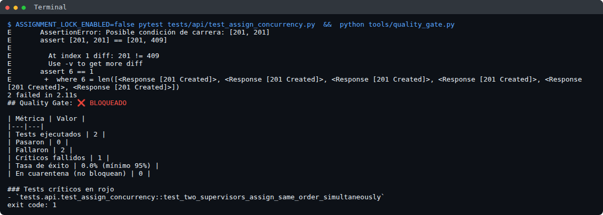

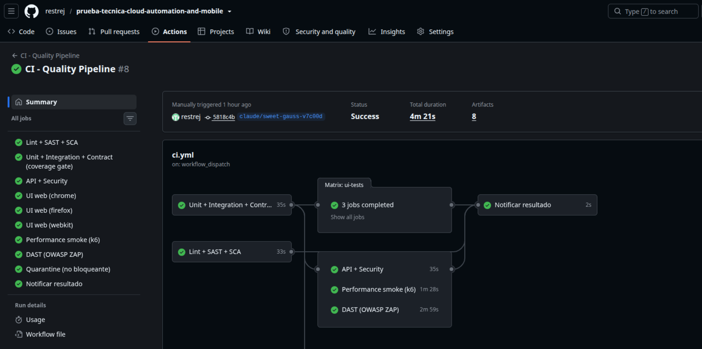

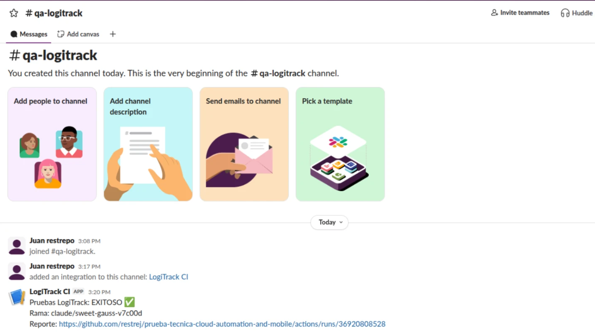

# Parte 4. Automatización técnica (25 puntos)

## Ejercicio A: pruebas de API (7 puntos)

*Qué piden: diseñar casos positivos (3 prioridades), negativos (token inválido, pedido inexistente, operador inactivo,
almacén inválido), límite (campos vacíos, formatos inválidos, pedido ya asignado) y de concurrencia; decir la
herramienta y el patrón; y mostrar código de al menos 1 caso positivo y 1 negativo.*

**Herramienta:** Python + **pytest** (ejecuta las pruebas) + **httpx** (envía las peticiones a la API).

**Patrón (forma de organizar el código):**
- **API Object:** una clase `LogiTrackApi` con un método por acción (`login`, `assign_order`). Las pruebas no
  escriben URLs ni encabezados; si la API cambia, se corrige en un solo lugar.
- **Constructor de datos:** `assign_payload()` arma un pedido válido y cada prueba cambia solo el dato que le interesa.
- **Datos propios por prueba:** cada prueba crea su propio pedido, así ninguna depende de otra.

Todas las peticiones van a `POST /api/v1/orders/assign` con el token de un supervisor del almacén `WH-05`, salvo que el
caso diga lo contrario. Cuando hay un error, la API responde siempre con el mismo formato: `{"error": {"code", "message"}}`.

| ID | Tipo | Caso de prueba | Resultado esperado |
|---|---|---|---|
| API-01 | Positivo | Verificar la asignación exitosa con prioridad NORMAL, URGENT y EXPRESS (una prueba por prioridad) | Código **201 Creado**. La respuesta trae `status: "ASSIGNED"`, la prioridad enviada, el operador, el almacén y un número de asignación. El pedido aparece asignado a ese operador |
| API-02 | Negativo | Validar que se rechaza un token vacío, inventado o con firma falsa | **401 No autorizado** con `code: "UNAUTHORIZED"`. El pedido no cambia |
| API-03 | Negativo | Validar la respuesta para un pedido que no existe (`ORD-2025-999999`) | **404 No encontrado** con `code: "ORDER_NOT_FOUND"` |
| API-04 | Negativo | Validar que no se puede asignar a un operador inactivo (`OP-999`) | **422** con `code: "OPERATOR_INACTIVE"`. El pedido sigue sin asignar |
| API-05 | Negativo | Validar los tres tipos de almacén inválido | Almacén que no existe (`WH-99`): **404** `WAREHOUSE_NOT_FOUND`. Formato inválido (`BODEGA-5`): **400** `VALIDATION_ERROR`. Almacén distinto al del pedido: **422** `WAREHOUSE_MISMATCH` |
| API-06 | Límite | Validar cada campo obligatorio vacío o ausente (`orderId`, `operatorId`, `warehouseId`, `priority`) | **400** con `code: "VALIDATION_ERROR"` y el nombre del campo que falla |
| API-07 | Límite | Validar IDs con formato inválido (minúsculas, dígitos de más o de menos) | **400** `VALIDATION_ERROR` indicando el campo y el formato esperado |
| API-08 | Límite | Validar que no se reasigna un pedido ya asignado a otro operador | **409 Conflicto** con `code: "ORDER_ALREADY_ASSIGNED"`. El pedido **sigue** asignado al primer operador |
| API-09 | Concurrencia | Verificar que dos supervisores que asignan el mismo pedido **al mismo tiempo** no generan una asignación duplicada | Uno recibe **201** y el otro **409**. El pedido queda con un solo operador |

**Código: caso positivo** (`tests/api/test_assign_positive.py`)

```python
@pytest.mark.critical
@pytest.mark.parametrize("priority", ["NORMAL", "URGENT", "EXPRESS"])   # se ejecuta 3 veces
def test_assign_order_successfully_with_each_priority(api, priority):
    order_id = api.create_test_order()                                    # 1. preparar: pedido nuevo
    response = api.assign_order(assign_payload(orderId=order_id, priority=priority))   # 2. ejecutar
    assert response.status_code == 201                                    # 3. verificar
    assert response.json()["status"] == "ASSIGNED"
    assert response.json()["priority"] == priority
```

**Código: caso negativo** (`tests/api/test_assign_negative.py`)

```python
def test_inactive_operator_returns_422(api):
    order_id = api.create_test_order()
    response = api.assign_order(assign_payload(orderId=order_id, operatorId="OP-999"))  # operador inactivo
    assert response.status_code == 422
    assert response.json()["error"]["code"] == "OPERATOR_INACTIVE"
```

**Código: concurrencia.** Uso una "barrera" que hace que los 2 hilos envíen la petición en el mismo instante:

```python
barrier = threading.Barrier(2)                      # los 2 hilos esperan aquí y salen juntos
def assign(client, operator_id):
    barrier.wait()
    return client.assign_order(assign_payload(orderId=order_id, operatorId=operator_id))
statuses = sorted(r.status_code for r in [supervisor_1_response, supervisor_2_response])
assert statuses == [201, 409]                       # uno gana y el otro recibe "conflicto"
```

Ejecución real: 40 casos de API en verde.

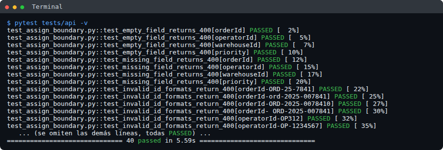

## Ejercicio B: automatización de la interfaz web (5 puntos)

*Qué piden: una suite para el login con caso exitoso, credenciales inválidas (3 combinaciones), validaciones de campos,
una estrategia de localizadores resistente a cambios y el código del caso exitoso.*

**Herramienta:** **Playwright**, que espera solo a que cada elemento esté listo (menos pruebas inestables). Las mismas
pruebas se ejecutan en **Google Chrome, Firefox y WebKit** (el motor de Safari) cambiando una opción del comando.
**Patrón Page Object:** una clase por pantalla (`LoginPage`, `DashboardPage`) con sus elementos y acciones.

**Suite (18 pruebas):** login exitoso con verificación del panel; usuario incorrecto, contraseña incorrecta y ambos
incorrectos; campos vacíos; caracteres especiales; longitud máxima (50 y 64); contraseña oculta; enlace
"¿Olvidaste tu contraseña?"; entrar al panel sin sesión regresa al login.

**¿Cómo encontrar los elementos sin que las pruebas se rompan?** Un **localizador** es la "dirección" que usa la prueba
para encontrar un elemento en la pantalla (un campo, un botón). Si la dirección cambia, la prueba se rompe.

**1. `data-testid` (mi elección).** Es un atributo que el desarrollador agrega a cada elemento importante **solo para
las pruebas**. No se ve en la pantalla y no afecta el diseño. Sirve porque no cambia aunque cambien los colores, los
textos, el idioma o la estructura de la página. Se acuerda con el equipo de desarrollo (en Angular se escribe en la
plantilla HTML del componente).

```html
<input data-testid="login-username" type="text">        <!-- así se marca en el HTML -->
```

```python
page.get_by_test_id("login-username")                    # así lo localiza Playwright
```

**2. Rol + texto visible.** Busca el elemento como lo ve una persona: por su **tipo** (botón, enlace, campo de texto)
y por el **texto** que muestra. Sirve cuando no hay `data-testid` y, además, confirma que la pantalla es accesible para
lectores de pantalla. Su debilidad: si cambian el texto (de "Entrar" a "Ingresar") o el idioma, la prueba se rompe.

```html
<button type="submit">Entrar</button>                    <!-- un botón que dice "Entrar" -->
```

```python
page.get_by_role("button", name="Entrar")                # "el botón que dice Entrar"
```

**Comparación de las opciones (de mejor a peor):**

| Opción | Ejemplo | ¿Qué tan estable? | Por qué |
|---|---|---|---|
| **`data-testid`** | `get_by_test_id("login-submit")` | Muy estable | Es solo para pruebas; no cambia con el diseño ni con los textos |
| Rol + texto visible | `get_by_role("button", name="Entrar")` | Estable | Se rompe si cambian el texto o el idioma |
| IDs | `#mat-input-0` | Poco estable | En Angular muchos IDs se generan solos y cambian |
| Selectores CSS | `.btn.btn-primary.mt-2` | Poco estable | Dependen de clases de diseño que cambian seguido |
| XPath | `//div[2]/form/div[3]/button` | Frágil | Depende de la estructura exacta de la página; cualquier cambio lo rompe |

**Código del caso exitoso**

```python
class LoginPage:                                            # Page Object de la pantalla de login
    def __init__(self, page):
        self.page = page
        self.username_input = page.get_by_test_id("login-username")
        self.password_input = page.get_by_test_id("login-password")
        self.submit_button = page.get_by_test_id("login-submit")

    def login(self, username, password):
        self.username_input.fill(username)
        self.password_input.fill(password)
        self.submit_button.click()

def test_successful_login_shows_landing_page(page):
    page.goto("/control/login")
    LoginPage(page).login("supervisor1", "Sup3rvisor!2025")
    expect(page.get_by_test_id("dashboard-title")).to_have_text("Panel de pedidos")
    expect(page.get_by_test_id("welcome-message")).to_have_text("Bienvenido, Laura Gómez")
```

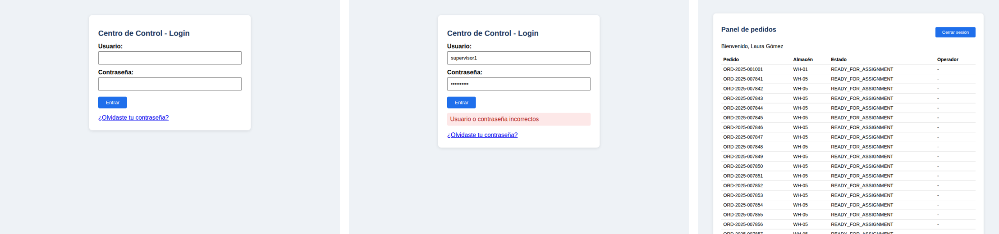

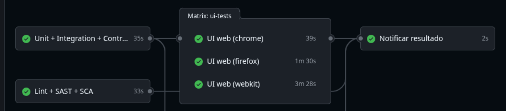

## Ejercicio C: automatización móvil (8 puntos)

### C.1 Arquitectura del framework móvil (3 puntos)

*Qué piden: qué herramienta usar para Flutter y por qué, cómo manejar los localizadores en Flutter frente a apps
nativas, y qué configuración (capabilities) usar.*

**Herramienta: Appium + Python.** Prueba la app **real instalada** (igual que la usa el operador), funciona en Android
e iOS, puede manejar cosas del sistema (permisos, teclado, red) y usa el mismo lenguaje que el resto de las pruebas.
Lo complemento con las pruebas propias de Flutter (`flutter test`), que son muy rápidas para la lógica de cada pantalla.
Otras opciones: Flutter Integration Test (rápido pero solo en Dart y sin acceso al sistema) y Maestro (muy simple,
pero menos flexible).

**Localizadores en Flutter frente a apps nativas.** En una app nativa cada botón ya trae su identificador. En Flutter
no: el desarrollador debe envolver el elemento con `Semantics(identifier: 'login-button')`. Flutter lo publica como
identificador en Android y en iOS, y Appium lo encuentra.

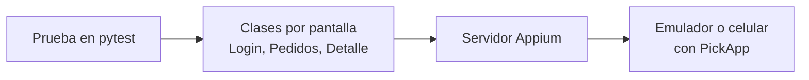

**Configuración (capabilities):** la "ficha" que le dice a Appium qué celular y qué app abrir.

```python
options = UiAutomator2Options()
options.platform_name = "Android"
options.automation_name = "UiAutomator2"                  # motor de automatización de Android
options.device_name = "Pixel 6"                           # celular o emulador
options.app = "mobile-app/build/app/outputs/flutter-apk/app-debug.apk"   # la app a instalar
options.auto_grant_permissions = True                     # acepta permisos (cámara) solo
options.no_reset = False                                  # app limpia en cada prueba
```

### C.2 Suite de pruebas del flujo (3 puntos)

*Qué piden: el flujo completo, cómo simular el escáner en el emulador, cómo manejar las esperas y cómo probar en
diferentes pantallas.*

- **Flujo completo:** login → lista de pedidos → seleccionar pedido → escanear los 2 productos → confirmar → "Guía Generada".
  Además: recogida en tienda, rechazo, producto que no es del pedido y credenciales inválidas.
- **Simular el escáner:** el escáner de almacén funciona como un teclado. La prueba **escribe el código** en el campo
  de escaneo y **presiona Enter**, exactamente lo que hace el escáner real.
- **Esperas:** nunca uso pausas fijas ("espera 5 segundos"). Uso **esperas inteligentes**: "espera **hasta** que
  aparezca el elemento, máximo 15 segundos". Si aparece en medio segundo, la prueba sigue en medio segundo.
- **Diferentes pantallas:** la misma suite se ejecuta en varios emuladores (Pixel 6 con Android 14 y Nexus 5 con
  pantalla pequeña y Android 11); en la versión candidata, en celulares reales del almacén. Caso real: en el Nexus 5
  el botón "Rechazar" quedaba debajo del borde de la pantalla (el teclado ocupaba la mitad). Por eso la acción de
  tocar primero oculta el teclado y, si el botón no está a la vista, **desplaza la pantalla** hasta encontrarlo.
- **Celular real:** las mismas pruebas corren en un Android físico conectado por USB, cambiando solo la configuración.
  Para ver lo que pasa en el celular desde el PC uso **Vysor**, que muestra su pantalla en el computador.

### C.3 Código: login y uso de elementos de Flutter (2 puntos)

```python
def flutter_id(identifier):
    """Busca un elemento de Flutter por su Semantics identifier."""
    return AppiumBy.ANDROID_UIAUTOMATOR, f'new UiSelector().resourceId("{identifier}")'

class LoginScreen(BaseScreen):
    def login(self, username, password):
        self.type_text("login-username", username)   # espera, toca el campo y escribe
        self.type_text("login-password", password)
        self.tap("login-button")                     # espera a que se pueda tocar y lo toca
        return OrdersScreen(self.driver)

def test_happy_path(driver):
    orders = LoginScreen(driver).login("OP-312", "Pick2025!")
    detail = orders.open_order("ORD-2025-007841")
    detail.scan("7501234567890")                     # simula el escáner
    detail.scan("7501234567891")
    assert "Guía Generada" in detail.confirm().status()
```

Del lado de Flutter, así se marca un elemento para que Appium lo encuentre:

```dart
Semantics(identifier: 'login-button',
          child: FilledButton(onPressed: _login, child: const Text('Ingresar')))
```

**Resultado real:** las 5 pruebas de Appium pasaron en GitHub Actions sobre un emulador Android (la app se compila,
se instala y se prueba automáticamente en cada ejecución). Capturas tomadas por Appium durante el flujo completo:

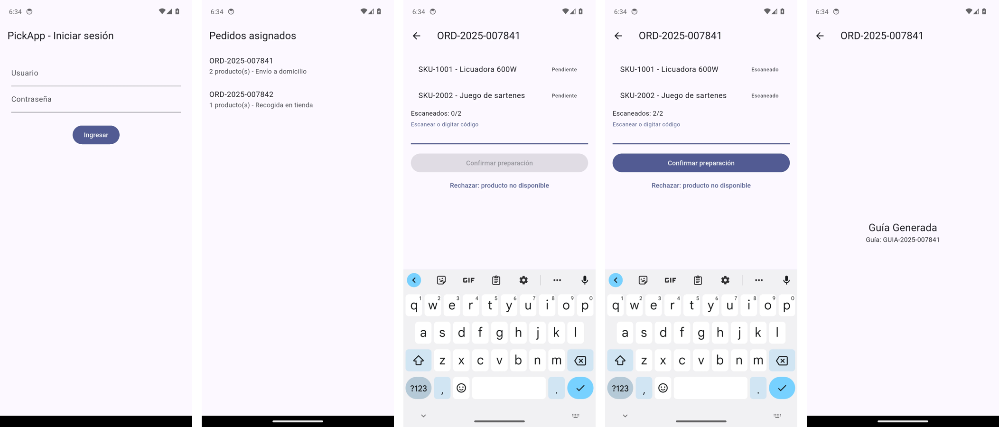

# Parte 5. Pruebas de rendimiento y seguridad (10 puntos)

## Ejercicio A: Rendimiento (5 puntos)

### 5.1 Plan de pruebas de rendimiento (3 puntos)

*Qué piden: tabla con 4 tipos de prueba (carga, estrés, resistencia y picos), qué herramienta usar y por qué.*

Datos: hoy, 500 peticiones por minuto en la hora pico. Con 40% de crecimiento: **700 peticiones por minuto**.

| Tipo de prueba | Objetivo | Configuración | Métricas a medir | Criterios de aceptación |
|---|---|---|---|---|
| **Carga** | ¿Soporta el pico del próximo año? | 700 peticiones/min durante 30 minutos | Tiempo de respuesta, peticiones por segundo, % de errores | 95% de las respuestas en menos de 500 ms; errores menos de 1% |
| **Estrés** | ¿Hasta dónde aguanta y se recupera? | Subir por escalones: 2, 3 y 4 veces el pico | Punto donde empieza a fallar; tiempo de recuperación | Falla de forma controlada (sin perder datos) y se recupera en menos de 2 min |
| **Resistencia (Soak)** | ¿Aguanta horas sin degradarse? | 500 peticiones/min durante 4 horas | Memoria, conexiones a la base de datos, tiempo de respuesta por hora | Sin crecimiento de memoria ni de tiempos entre la hora 1 y la 4 |
| **Picos (Spike)** | ¿Qué pasa a las 7:00 cuando abren todos los almacenes? | Pasar de casi nada a 4 veces el pico en 10 segundos | Errores durante el salto; tiempo que tarda Cloud Run en crecer | Errores menos de 2%; normalidad en menos de 1 minuto |

**Herramienta: k6.** Los scripts se escriben en JavaScript y se guardan junto al código; los criterios de aceptación
van **dentro** del script y, si no se cumplen, la prueba falla sola (ideal para el pipeline); y consume pocos
recursos. JMeter es más pesado y sus archivos son difíciles de revisar; Gatling y Locust son buenas alternativas.

### 5.2 Script de prueba de carga (2 puntos)

*Qué piden: un script para `POST /api/v1/orders/assign` con 50 usuarios simultáneos, 5 minutos de duración, 1 minuto
de subida gradual, y que mida tiempos (p50, p95, p99), peticiones por segundo y tasa de error.*

Archivo: `performance/k6/assign_load_test.js` (resumen)

```javascript
export const options = {
  stages: [
    { duration: '1m', target: 50 },   // subida gradual: de 0 a 50 usuarios en 1 minuto
    { duration: '4m', target: 50 },   // 50 usuarios hasta completar 5 minutos
  ],
  summaryTrendStats: ['med', 'p(95)', 'p(99)', 'max'],   // med = p50
  thresholds: {                                          // criterios: si no se cumplen, falla
    'http_req_duration': ['p(95)<500', 'p(99)<1000'],    // milisegundos
    'http_req_failed':   ['rate<0.01'],                  // menos de 1% de errores
  },
};

export function setup() {                  // una sola vez: iniciar sesión y crear pedidos de prueba
  return { token: login(), orderIds: seedOrders(20000) };
}

export default function (data) {          // lo que hace cada usuario, una y otra vez
  const n = exec.scenario.iterationInTest;
  assignOrder(data.token, data.orderIds[n], n);   // POST /api/v1/orders/assign
  sleep(1);                                       // pausa como un usuario real
}
```

**Cómo leer p50, p95 y p99:** p95 = 59 ms significa que **el 95% de las peticiones tardó menos de 59 milisegundos**.

Resultado real (5 minutos, 50 usuarios): **12.829 peticiones, 42,6 por segundo, p50 = 53 ms, p95 = 59 ms,
p99 = 66 ms y 0% de errores**. Todos los criterios se cumplieron.

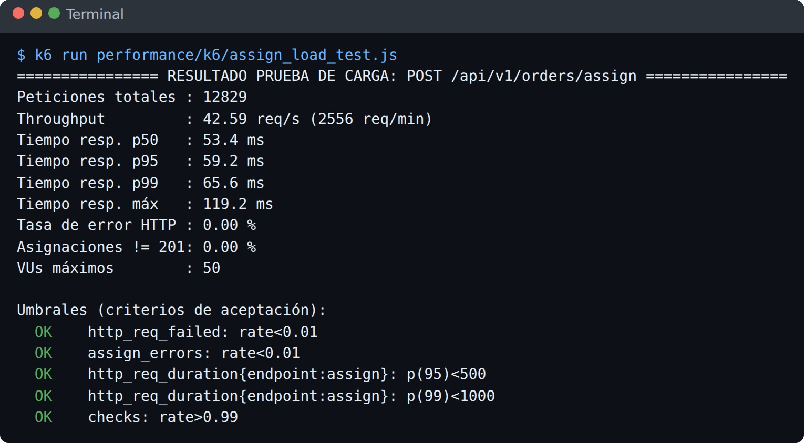

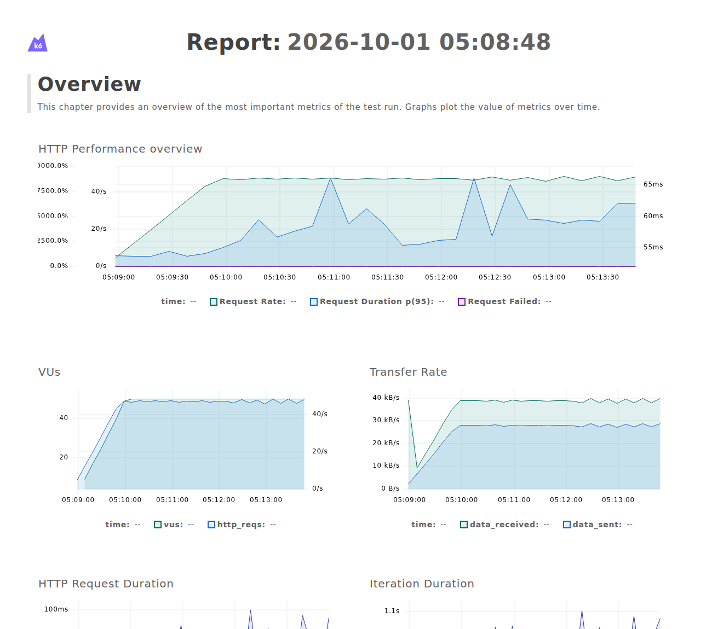

## Ejercicio B: Seguridad (5 puntos)

### 5.3 Pruebas de seguridad para `POST /api/v1/orders/assign` (3 puntos)

*Qué piden: pruebas de autenticación y autorización, inyección, validación de entradas y encabezados de seguridad.*

| Área | Qué pruebo | Resultado esperado |
|---|---|---|
| **Autenticación** | Sin token, token inventado, token **expirado**, token con firma falsificada | 401 No autorizado |
| **Autorización (roles)** | Un **operador** intenta asignar pedidos (solo pueden supervisores) | 403 Prohibido |
| **Escalamiento de privilegios** | Un supervisor del almacén WH-01 intenta asignar en WH-05; enviar campos extra como `"role": "ADMIN"` | 403 / 400 |
| **Inyección SQL** | `ORD-1' OR '1'='1`, `; DROP TABLE orders` en los campos | 400, nunca un error 500 |
| **Inyección NoSQL** | `{"$ne": null}` en lugar de texto | 400 |
| **Inyección de comandos** | `; ls -la /`, `&& cat /etc/passwd` | 400 |
| **Entradas mal formadas** | JSON cortado, vacío, campo de 10.000 caracteres | 400 sin mostrar detalles internos |
| **XSS** (código malicioso para el navegador) | `<script>alert(1)</script>` en los campos | 400 y el texto **no** se devuelve en la respuesta |
| **Encabezados de seguridad** | Que existan los encabezados que protegen al navegador (CSP y otros) | Presentes en todas las respuestas |
| **CORS** (qué sitios pueden llamar a la API) | Petición desde el Centro de Control y desde un sitio malicioso | Solo se permite el Centro de Control |
| **Límite de peticiones** | Muchas peticiones seguidas del mismo usuario | 429 "demasiadas peticiones" |

45 pruebas automatizadas en `tests/security/` (resultado real):

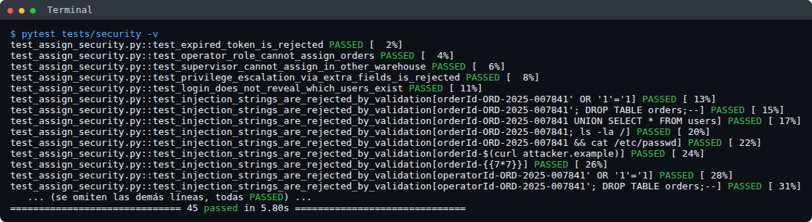

### 5.4 Herramientas de seguridad en el pipeline (2 puntos)

*Qué piden: al menos una herramienta SAST y una DAST, y en qué etapa del pipeline va cada una.*

- **SAST = revisar el código sin ejecutarlo**, buscando malas prácticas (contraseñas escritas en el código,
  consultas armadas con texto). Herramienta: **Bandit** (para Python). Etapa: **en cada Pull Request**, porque es rápida
  (segundos) y avisa antes de unir el cambio.
- **DAST = atacar la aplicación ya funcionando**, como lo haría un atacante. Herramienta: **OWASP ZAP** (gratuita).
  Etapa: **después de desplegar en el ambiente de pruebas** (merge a main y versión candidata), porque necesita la API en
  ejecución. Burp Suite es la otra herramienta conocida: es excelente para pruebas **manuales**, pero su versión
  automática es de pago.
- Además: **pip-audit** revisa si las librerías que usamos tienen vulnerabilidades conocidas (en cada Pull Request).

Resultado real de OWASP ZAP contra la API: **113 verificaciones superadas, 0 fallas y 1 advertencia menor** (un tipo de respuesta inesperado en páginas que no existen).

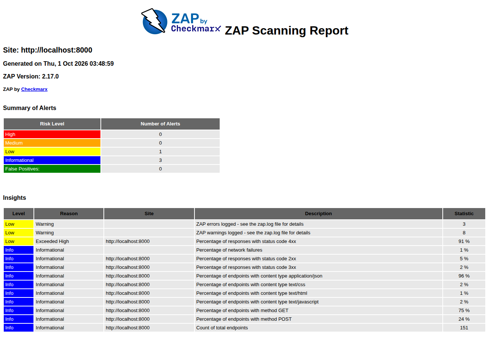

# Parte 6. Cloud y troubleshooting (10 puntos)

## 6.1 Investigación del aumento de errores 500 (4 puntos)

*Qué piden: qué herramientas de GCP usar y en qué orden, qué filtros aplicar a los logs, cómo relacionar el problema
entre microservicios y qué tableros y alertas configurar.*

Pista del escenario: el despliegue nuevo coincide con tiempos de espera agotados (timeouts) al llamar a
`inventory-service`, el servicio que maneja el inventario. Si el impacto es alto, **primero vuelvo a la versión
anterior** y después investigo.

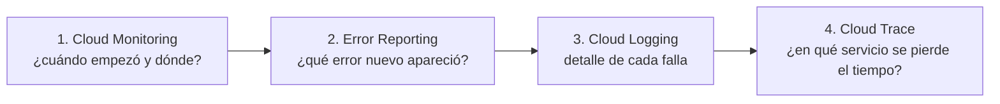

1. **Cloud Monitoring (gráficas):** confirmo que los errores empiezan justo con la versión nueva y comparo los
   tiempos de respuesta de orders-api y de inventory-service.
2. **Error Reporting (errores agrupados):** veo qué error nuevo apareció (por ejemplo, "tiempo de espera agotado").
3. **Cloud Logging (registros):** reviso el detalle de cada falla.
4. **Cloud Trace (recorrido de una petición):** veo en qué servicio se va el tiempo de cada petición.

**Filtros de logs:**

```text
resource.labels.service_name="orders-api" AND httpRequest.status>=500         # errores 500
resource.labels.service_name="orders-api" AND textPayload:"inventory" AND textPayload:"timeout"
resource.labels.service_name="inventory-service" AND httpRequest.latency>"3s" # lentitud en inventario
trace="projects/logitrack/traces/<id>"                       # todo lo de UNA petición en todos los servicios
```

**Relacionar el problema entre microservicios:** cada petición lleva un **número de seguimiento** (trace ID) que
pasa de un servicio a otro. Si todos los logs lo registran, con un solo filtro veo la petición completa en todos los
servicios. La API simulada del repositorio ya escribe sus logs en ese formato.

**Tableros y alertas:** porcentaje de errores 500 por servicio (alerta si supera 1% durante 5 minutos), tiempo de
respuesta (alerta si el 95% tarda más de 500 ms), tiempos agotados al llamar a otros servicios, conexiones a la base
de datos, mensajes acumulados sin procesar en Pub/Sub y una prueba automática del flujo de asignación cada 5 minutos.

## 6.2 Prueba que falla 3 de cada 10 veces (4 puntos)

*Qué piden: cómo saber si es un test inestable, una condición de carrera, un problema de infraestructura o un tiempo
de espera mal configurado, con el proceso paso a paso.*

**Proceso:** (1) ejecutar la prueba 30 veces y guardar evidencia de cada una; (2) ver si siempre falla en el mismo
paso y con el mismo error; (3) aislar: ejecutarla sola, en otro celular, en otro ambiente; (4) aplicar la tabla de
abajo; (5) corregir la causa y confirmar con 50 ejecuciones seguidas en verde.

| ¿Qué puede ser? | Cómo lo confirmo | Cómo lo resuelvo |
|---|---|---|
| **Test inestable** (problema de la prueba) | Busco pausas fijas, localizadores frágiles, datos compartidos entre pruebas o verificar antes de que el sistema termine | Esperas inteligentes, datos propios por prueba, `data-testid` |
| **Condición de carrera** (dos cosas al mismo tiempo; problema del sistema) | Los logs muestran dos operaciones simultáneas sobre el mismo pedido; falla más al correr en paralelo | Es un error del producto: bloqueo en la base de datos. La prueba de concurrencia lo detecta (ver abajo) |
| **Infraestructura** | Las fallas coinciden con arranques lentos de Cloud Run, CPU alta del emulador o red lenta | Más recursos o un ambiente de pruebas dedicado |
| **Tiempo de espera mal configurado** | Falla justo al llegar al límite (por ejemplo, a los 10 s) y la operación termina a los 12 s | Ajustar el tiempo con datos reales: el tiempo del 99% más un margen |

**Dos casos reales que viví en este proyecto:**
- **Condición de carrera:** sin el bloqueo, dos supervisores "ganan" el mismo pedido (`[201, 201]`) y la prueba lo
  detecta (ver la captura de la Parte 3.3).
- **Infraestructura:** las pruebas de Appium pasaban en un emulador (Nexus 5) y fallaban en otro (Pixel 6) sin
  cambiar el código. Agregué un diagnóstico que, al fallar, guarda la estructura de la pantalla; mostró la ventana
  del sistema *"Pixel Launcher isn't responding"* tapando la app. No era la prueba ni la app: era el emulador.
  Solución: más memoria al emulador y ocultar las ventanas de error del sistema antes de probar.

## 6.3 Gestión de pruebas inestables (2 puntos)

*Qué piden: cómo evitar que las pruebas inestables bloqueen el pipeline sin ignorarlas.*

1. **Reintento limitado:** máximo **1 reintento** automático, y queda registrado en el reporte.
2. **Cuarentena:** si una prueba falla más del 5% de las veces, se marca con `@pytest.mark.quarantine`. Se sigue
   ejecutando en un job aparte que **no bloquea**, pero se ve en cada ejecución.
3. **No se olvida:** cada prueba en cuarentena tiene un ticket, un responsable y una fecha límite (2 semanas).
4. **Reporte de inestabilidad:** `tools/flaky_report.py` ejecuta la prueba varias veces y calcula su tasa de fallo.
5. **Sale de cuarentena** cuando se corrige la causa y pasa 50 veces seguidas.

Resultado real con una prueba de demostración que falla a propósito algunas veces:

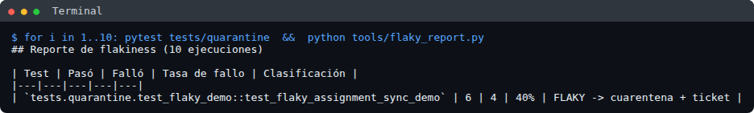

# Parte 7. Comunicación y presentación de resultados (5 puntos)

## 7.1 Estructura del informe ejecutivo (3 puntos)

*Qué piden: secciones, métricas clave con gráficos sugeridos, si está listo para producción, riesgos con su plan y
próximos pasos.*

Esta es la estructura del informe que presentaría a la gerencia, con un ejemplo de su contenido usando los datos
del enunciado (23 defectos, 3 críticos, 5 de 9 módulos probados, 35% de la regresión automatizada).

1. **Resumen ejecutivo (máximo 1 página del informe).** Estado general con semáforo: **amarillo, no listo para
   producción todavía**. Se encontraron 23 errores antes de llegar al cliente; 3 son críticos y bloquean la salida; la
   automatización cubre el 35% de la regresión.
2. **Avance.** 5 de 9 módulos probados (barra de progreso), 40 pruebas automatizadas (línea de tendencia semanal),
   35% de la regresión automatizada frente a una meta de 70% (indicador tipo velocímetro).
3. **Calidad del producto.** 23 errores: 3 críticos, 8 altos y 12 medios (barras por severidad) y un mapa de calor
   módulo × severidad para ver dónde se concentran.
4. **¿Listo para producción?** No. Falta: 0 errores críticos abiertos, los flujos principales en verde 3 veces
   seguidas, probar los 4 módulos restantes y una prueba de rendimiento aprobada.
5. **Riesgos y plan:**

| Riesgo | Plan |
|---|---|
| 3 errores críticos sin corregir | Prioridad en el sprint actual y revisión diaria |
| 4 módulos sin probar | Empezar por los de mayor riesgo: Despacho y Login |
| Sin pruebas de rendimiento ni seguridad | Ya están en el pipeline; ejecución completa en 2 semanas |
| 65% de la regresión aún manual | Plan de automatización por riesgo |

6. **Próximos pasos:** volver a probar los críticos (3 días), probar los 4 módulos restantes (2 semanas), 30 pruebas
   automatizadas más (4 semanas) y llegar al 70% de automatización (3 meses).

## 7.2 Respuesta al Gerente de Operaciones (2 puntos)

*Qué piden: máximo 200 palabras, valor de negocio sin términos técnicos, un ejemplo del proyecto y el retorno de la
inversión esperado.*

> Recomiendo invertir en automatización porque protege la operación de los almacenes y nos permite crecer sin
> aumentar los errores.
>
> Hoy, revisar a mano todo lo que ya funciona toma unos tres días. Como publicamos cambios con frecuencia, el equipo
> alcanza a revisar solo una parte, y los errores llegan a los almacenes: pedidos sin inventario, pedidos duplicados y
> entregas retrasadas.
>
> Un ejemplo de este proyecto: si un cambio vuelve a permitir que un pedido se asigne a dos operadores, hoy lo
> descubrimos cuando dos personas preparan el mismo pedido y otro cliente queda sin atender. Con automatización, esa
> verificación se ejecuta sola en minutos, en cada cambio y antes de llegar al almacén.
>
> La automatización no reemplaza al equipo: asume las revisiones repetitivas y libera a las personas para lo que
> requiere criterio humano, como probar con escáneres reales en el almacén.
>
> Retorno esperado: automatizar el 70% de las revisiones libera cerca de 15 días de trabajo al mes. La inversión
> inicial, de unos tres meses, se recupera en aproximadamente seis meses. A esto se suma el mayor beneficio: menos
> pedidos retrasados, menos reprocesos y menos reclamos de clientes.

*(189 palabras; el límite es 200)*

# Bonus. Análisis de arquitectura y riesgos (20 puntos)

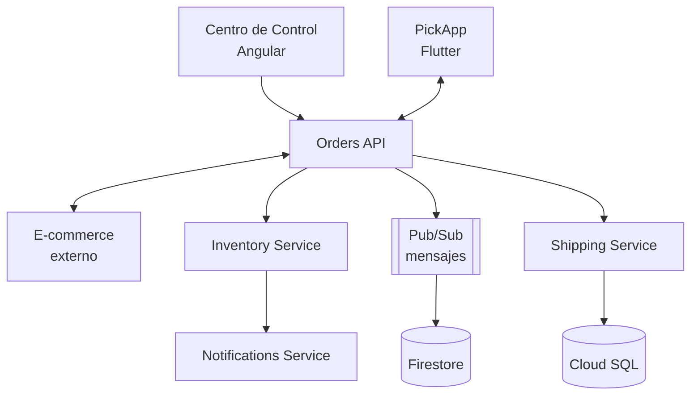

## B.1 Riesgos de calidad (6 puntos)

*Qué piden: al menos 5 riesgos con descripción, probabilidad, impacto, la prueba que lo detectaría y cómo mitigarlo.*

| Riesgo | Descripción | Probabilidad | Impacto | Prueba que lo detectaría | Estrategia de mitigación |
|---|---|---|---|---|---|
| Asignación duplicada | Dos supervisores asignan el mismo pedido a la vez y ambos "ganan" | Alta | Alto | Prueba de concurrencia (implementada) | Bloqueo en la base de datos; responder 409 al segundo |
| Pedidos sin stock | Un mensaje entre servicios se pierde o llega dos veces y el inventario queda mal | Alta | Alto | Prueba de integración con mensajes repetidos o perdidos | Procesar cada mensaje una sola vez y guardar los fallidos para reintentar |
| Caída en cadena | Si inventory-service se pone lento, orders-api también falla (escenario 6.1) | Media | Alto | Prueba de estrés con un servicio lento a propósito | Tiempos de espera cortos y cortar llamadas a un servicio que está fallando |
| Cambios que rompen la app | La API cambia un campo y la app vieja instalada en los celulares deja de funcionar | Media | Alto | Pruebas de contrato | Versionar la API (`/v1`, `/v2`) y no borrar campos |
| Tablero desactualizado | Firestore no recibe la actualización y el supervisor ve datos viejos | Alta | Medio | Prueba de punta a punta que mide cuánto tarda en reflejarse | Alerta si el retraso supera 5 segundos y conciliación periódica |
| Seguridad | Un usuario accede a datos de otro almacén | Media | Alto | Pruebas de seguridad + OWASP ZAP | Validar el almacén en cada petición |

## B.2 Puntos de falla y pruebas de contrato (6 puntos)

*Qué piden: los puntos de falla y una estrategia de contratos para 3 conexiones, con la herramienta y su justificación.*

**Puntos de falla:** la red móvil entre PickApp y la API; el e-commerce externo (no lo controlamos); los mensajes de
Pub/Sub (pueden llegar repetidos o desordenados); las llamadas directas entre servicios (si uno se pone lento, arrastra
a los demás); y la actualización de Firestore.

Una **prueba de contrato** verifica que el **formato acordado** entre dos sistemas no cambie sin aviso.

| Conexión | Estrategia |
|---|---|
| **PickApp ↔ Orders API** | La app define qué campos necesita; la API verifica en **cada Pull Request** que sigue cumpliendo. Si un cambio rompe a una versión de la app que sigue instalada en los celulares, no se puede desplegar |
| **Orders API ↔ E-commerce (externo)** | Como no podemos pedirle que ejecute nuestras pruebas: comparamos nuestras expectativas contra su documentación oficial (OpenAPI), usamos una copia simulada en las pruebas y hacemos una revisión programada contra su ambiente de pruebas para detectar cambios no anunciados |
| **Orders API ↔ Pub/Sub (mensajes)** | El formato del mensaje "pedido asignado" se define en un archivo de esquema (JSON Schema). La API verifica que sus mensajes lo cumplen y los consumidores, que lo entienden. Implementado en `contracts/` y `tests/contract/` |

**Herramienta: Pact**, porque es la más usada para este tipo de pruebas, sirve para la API **y para mensajes**, y tiene
librerías para Dart (Flutter), JavaScript y Python. Además guarda qué versión es compatible con cuál.
**Schemathesis** es un buen complemento (genera miles de peticiones a partir de la documentación de la API), y
**Spring Cloud Contract** solo conviene si todo estuviera hecho en Java.

## B.3 Plan de regresión (4 puntos)

*Qué piden: qué flujos probar en cada versión, cuáles cada semana y cómo priorizar su automatización.*

- **En cada versión (obligatorios, unos 40 minutos automatizados):** pedido a domicilio completo hasta la guía; recogida
  en tienda; rechazo por falta de stock; asignación simultánea sin duplicados; login y permisos por rol; el tablero
  refleja la asignación.
- **Cada semana:** gestión de usuarios e insumos, reportes, alertas, casos límite (50 productos, sesión expirada,
  red intermitente), todos los celulares y navegadores, prueba de resistencia y seguridad completa.
- **Prioridad:** impacto en el negocio × frecuencia de uso × cuántos errores ha tenido. Primero por API (barato y
  estable), luego web, luego móvil. Cada error que llega a producción se convierte en una prueba nueva.

## B.4 Estrategia para reducir errores en producción (4 puntos)

*Qué piden: probar desde el inicio (shift-left), funcionalidades con interruptor (feature flags), monitoreo sintético,
ambientes previos a producción y revisión de código desde QA.*

- **Shift-left (probar desde el inicio):** QA participa cuando se define la funcionalidad, con criterios de aceptación
  claros; las pruebas automáticas se escriben en el mismo cambio que el código.
- **Feature flags (interruptores):** cada funcionalidad nueva se activa primero en un almacén piloto y, si falla, se
  apaga al instante sin desplegar de nuevo.
- **Monitoreo sintético:** un robot ejecuta el flujo de asignación en producción cada 5 minutos y avisa si falla
  antes de que lo note un operador.
- **Ambientes previos a producción:** un ambiente igual a producción, con datos parecidos, donde corre la regresión
  completa, el rendimiento y la seguridad antes de cada versión.
- **Revisión de código desde QA:** una lista de verificación en cada Pull Request: ¿tiene pruebas?, ¿cubre casos de
  error?, ¿qué pasa si dos usuarios lo hacen a la vez?, ¿tiene sus `data-testid`?

# Anexo: código fuente

Todo el código de este documento (pruebas de API, web, móvil, rendimiento, seguridad y los pipelines) está disponible
y se puede ejecutar: <https://github.com/restrej/prueba-tecnica-cloud-automation-and-mobile>.
