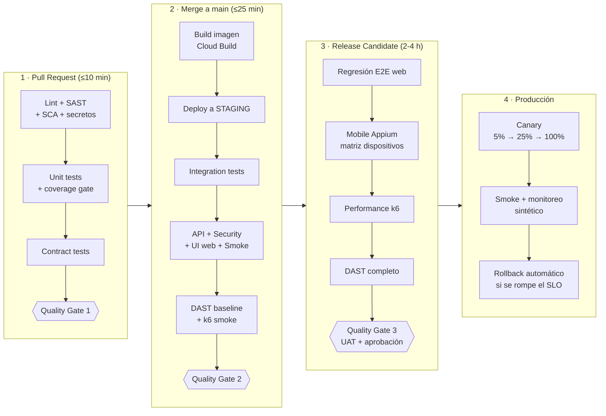

# Parte 3. Automatización y CI/CD

Situación actual: `Push a GitHub → Build → Deploy a Producción`, sin validaciones intermedias.

## 3.1 Pipeline CI/CD ideal



| Etapa | Qué se ejecuta | Tiempo estimado | Condición de paso / bloqueo (Quality Gate) |
|---|---|---|---|
| Lint + SAST + SCA + secretos | Ruff/ESLint/`flutter analyze`, Semgrep/Bandit, pip-audit/Dependabot, Gitleaks | 2–3 min | **Bloquea** con: error de lint, hallazgo SAST *High/Critical*, CVE *High/Critical* sin excepción aprobada, cualquier secreto en el código |
| Unit tests | pytest/JUnit/Jest + `flutter test` | 2–4 min | **100% pasan**; cobertura total ≥ 80% y **≥ 90% en código nuevo** |
| Contract tests | Verificación de proveedor (Pact) + esquemas de eventos Pub/Sub | 1–2 min | **Bloquea** si se rompe un contrato con un consumidor existente (`can-i-deploy` = no) |
| Build + firma | Imagen Docker en Cloud Build, escaneo de imagen (Artifact Analysis), firma (Binary Authorization) | 3–5 min | Imagen sin vulnerabilidades críticas; firmada |
| Deploy a staging | Cloud Run (revisión nueva) | 1–2 min | Health check `/health` OK |
| Integration tests | Servicios + Cloud SQL (Testcontainers), emuladores Pub/Sub/Firestore | 4–6 min | **100% pasan** |
| API + Security tests | `pytest -m "api or security"` | 3–5 min | **0 tests `@critical` fallidos** y pass rate ≥ 95% |
| UI web + Smoke | Playwright (Centro de Control) | 4–6 min | 0 críticos fallidos; smoke 100% |
| DAST baseline + k6 smoke | ZAP baseline/API scan, k6 1 min | 5 min | 0 alertas ZAP en *FAIL* (inyección, XSS); k6: p95 < 500 ms, errores < 1% |
| Regresión E2E + Mobile | Playwright completo + Appium en 3–5 dispositivos | 45–90 min | Pass rate ≥ 98%; 0 críticos; flaky en cuarentena no cuenta |
| Performance | k6 carga (+40%) y spike | 30–60 min | p95 < 500 ms, p99 < 1 s, errores < 1% al 140% del pico |
| Aprobación | UAT + revisión de reporte por QA Lead | 1–2 días | Firma de aprobación (environment protection rule en GitHub) |
| Canary + producción | Tráfico gradual en Cloud Run + smoke + sintéticos | 30–60 min | Error 5xx < 1% y p95 < 800 ms durante cada escalón; si no → **rollback automático** |

## 3.2 Mecanismos para impedir que código defectuoso llegue a producción

**Branch protection rules (sobre `main` y `release/*`):**
- Prohibido el push directo; todo cambio entra por **Pull Request**.
- **≥ 1 aprobación** (2 en servicios críticos), con **CODEOWNERS** (QA revisa cambios en tests y contratos).
- Las aprobaciones se descartan si llegan commits nuevos; conversaciones resueltas obligatorias.
- Rama actualizada con `main` antes del merge; historial lineal; aplica también a administradores.
- Commits firmados opcionales; prohibido force-push y borrado de la rama.

**Required checks** (deben estar en verde para habilitar "Merge"):
`Lint + SAST + SCA`, `Unit + Integration + Contract (coverage gate)`, `API + Security + UI (Playwright)`,
`DAST (OWASP ZAP)`, `Performance smoke (k6)`. El job de **cuarentena NO es requerido**.

**Coverage gates:** `--cov-fail-under=80` global y, en el PR, cobertura del **código modificado ≥ 90%**
(diff-cover o Codecov "patch" status). La cobertura nunca puede **bajar** más de 1 punto respecto a `main`.

**Canary deployments (Cloud Run):** se despliega una revisión nueva **sin tráfico** (`--no-traffic`),
se le asigna 5% (`gcloud run services update-traffic --to-revisions=NEW=5`), se observan 10–15 minutos
las métricas de la revisión (5xx, p95, errores de Pub/Sub, métricas de negocio como "asignaciones/min"),
y se avanza 25% → 50% → 100%. Para la app mobile: **staged rollout** en Play Store/TestFlight (1% → 10% → 100%)
+ **feature flags** (Firebase Remote Config).

**Rollback automático:** un job (Cloud Deploy con *verification* o un workflow) consulta Cloud Monitoring
en cada escalón; si se cumplen las condiciones de rollback (5xx > 1%, p95 > 800 ms, caída de "pedidos asignados/min" > 20%),
se ejecuta `gcloud run services update-traffic --to-revisions=PREVIOUS=100`, se notifica a Slack y se abre un incidente.
Las migraciones de base de datos deben ser **compatibles hacia atrás** (*expand/contract*) para que el rollback sea seguro.

## 3.3 Pipeline funcional (GitHub Actions)

Archivo completo y comentado: **`.github/workflows/ci.yml`** (en el repositorio). Cumple cada requisito así:

| Requisito | Cómo se cumple |
|---|---|
| Ejecute pruebas automatizadas | Jobs `unit-integration`, `functional-tests` (API + seguridad + UI), `performance-smoke`, `dast-zap` |
| Genere un reporte de resultados | `--junitxml` + `--html` (pytest-html), resumen de k6, reporte HTML de ZAP, resumen Markdown en la página de la ejecución (`$GITHUB_STEP_SUMMARY`) |
| Publique el reporte como artefacto | `actions/upload-artifact@v4` con `if: always()` (se publica aunque fallen las pruebas) |
| Falle si hay tests críticos en rojo | `tools/quality_gate.py` lee el JUnit; los tests `@pytest.mark.critical` llevan la propiedad `critical=true`; si alguno falló → `exit 1` |
| Notificación del resultado | Job `notify` (`if: always()`) envía a **Slack** vía webhook (secreto `SLACK_WEBHOOK_URL`) con el estado de cada job y el enlace a los reportes |

Fragmento clave (quality gate):

```yaml
      - name: Ejecutar pruebas funcionales
        id: tests
        continue-on-error: true      # dejamos que el QUALITY GATE decida
        run: >
          pytest -m "(api or security or ui) and not quarantine"
          --reruns 1 --reruns-delay 1
          --junitxml=reports/junit-functional.xml
          --html=reports/functional-report.html --self-contained-html

      - name: Publicar reportes como artefacto
        if: always()
        uses: actions/upload-artifact@v4
        with:
          name: functional-test-reports
          path: reports/

      - name: QUALITY GATE - bloquear si hay tests críticos en rojo
        run: python tools/quality_gate.py "reports/junit-functional.xml"
```

Evidencia local del gate bloqueando (se provocó el bug de concurrencia con `ASSIGNMENT_LOCK_ENABLED=false`):

```text
## Quality Gate: ❌ BLOQUEADO
| Tests ejecutados | 40 | Pasaron | 38 | Fallaron | 2 | Críticos fallidos | 1 |
### Tests críticos en rojo
- tests.api.test_assign_concurrency::test_two_supervisors_assign_same_order_simultaneously
exit=1
```

### Evidencia: ejecución real en GitHub Actions

Ejecución #2 del workflow `CI - Quality Pipeline` (commit `7e116d8`):
<https://github.com/restrej/prueba-tecnica-cloud-automation-and-mobile/actions/runs/36812798479>. Resultado: **success**.

| Job | Resultado | Duración |
|---|---|---|
| Lint + SAST + SCA (Ruff, Bandit, Semgrep, pip-audit) | ✅ success | 43 s |
| Unit + Integration + Contract (coverage gate) | ✅ success | 23 s |
| API + Security + UI (Playwright) + Quality Gate | ✅ success | 53 s |
| Performance smoke (k6) | ✅ success | 1 min 24 s |
| DAST (OWASP ZAP) | ✅ success | 2 min 57 s |
| Quarantine (no bloqueante) + reporte de flakiness | ✅ success | 45 s |
| Notificar resultado | ✅ success (paso de Slack omitido: falta configurar el secreto `SLACK_WEBHOOK_URL`) | 3 s |

Duración total del pipeline: **≈ 4 minutos**, dentro del objetivo de 10 minutos para PR.

La ejecución #1 falló en el job estático porque `pip install semgrep` no encontró un paquete para el runner;
se corrigió usando la imagen Docker oficial de Semgrep (commit `7e116d8`). Así funciona el pipeline: el problema
se detectó y se corrigió antes de llegar a `main`.
