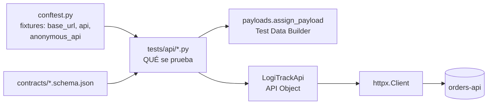
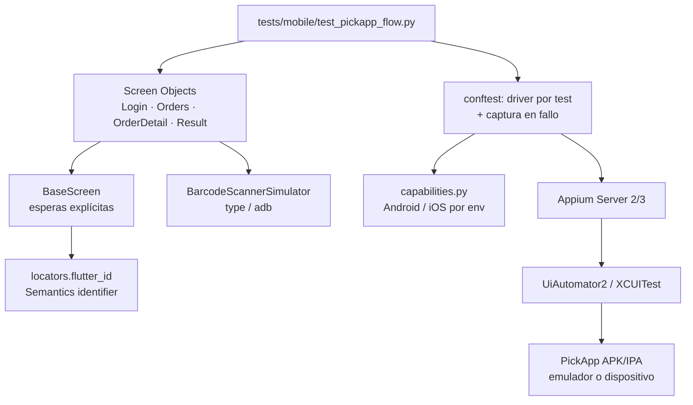

# Parte 4. Automatización técnica

## Ejercicio A: API testing de `POST /api/v1/orders/assign`

### Herramienta y arquitectura

**Python + pytest + httpx**, con estos patrones:



- **API Object** (`framework/api/logitrack_api.py`): un método por operación (`login`, `assign_order`); los tests no arman URLs ni headers.
- **Test Data Builder** (`assign_payload(**cambios)`): payload válido por defecto; cada test cambia **sólo** el campo que prueba.
- **Fixtures** (`tests/conftest.py`): levantan el servicio, entregan clientes autenticados y aislan datos (cada test crea **su propio pedido** con `create_test_order()` → sin dependencias entre tests, paralelizable).
- **Markers** (`api`, `critical`, `smoke`, `concurrency`) para armar suites y para el quality gate.
- **Validación de contrato** con JSON Schema además de las aserciones funcionales.

### Diseño de casos (implementados: 40 casos parametrizados)

| Categoría | Caso | Esperado | Archivo |
|---|---|---|---|
| Positivo | Asignación con `NORMAL`, `URGENT`, `EXPRESS` | 201 + cuerpo + evento Pub/Sub | `test_assign_positive.py` |
| Positivo | Reintento idéntico (misma orden y operador) | 200, mismo `assignmentId` (idempotente) | `test_assign_positive.py` |
| Negativo | Token vacío, texto libre, JWT basura, firma falsa | 401 + `WWW-Authenticate: Bearer` | `test_assign_negative.py` |
| Negativo | Pedido inexistente | 404 `ORDER_NOT_FOUND` | ″ |
| Negativo | Operador inactivo (`OP-999`) | 422 `OPERATOR_INACTIVE` | ″ |
| Negativo | Almacén inexistente / formato inválido / no corresponde | 404 / 400 / 422 | ″ |
| Negativo | Pedido sin stock (`PENDING_RESTOCK`) | 409 `ORDER_NOT_ASSIGNABLE` | ″ |
| Límite | Cada campo vacío `""` y cada campo ausente | 400 indicando el campo | `test_assign_boundary.py` |
| Límite | IDs mal formados (minúsculas, dígitos de más/menos, espacios, tipo numérico, enum inválido) | 400 | ″ |
| Límite | `operatorId` con 1 y 6 dígitos (bordes válidos) | pasa validación (404 porque no existe) | ″ |
| Límite | Pedido ya asignado a otro operador | 409 `ORDER_ALREADY_ASSIGNED`, dueño intacto | ″ |
| Concurrencia | 2 supervisores asignan el mismo pedido a la vez (`threading.Barrier`) | exactamente `[201, 409]` y 1 solo evento | `test_assign_concurrency.py` |
| Concurrencia | 6 peticiones simultáneas a 3 operadores | 1 sola creación; el resto 409/200 | ″ |

**Prueba de que la prueba de concurrencia funciona:** con `ASSIGNMENT_LOCK_ENABLED=false` el servicio pierde el bloqueo por pedido y la prueba falla con `assert [201, 201] == [201, 409]` (el bug real de "asignaciones duplicadas").

### Código: caso positivo

```python
@pytest.mark.smoke
@pytest.mark.critical
@pytest.mark.parametrize("priority", ["NORMAL", "URGENT", "EXPRESS"])
def test_assign_order_successfully_with_each_priority(api, priority):
    order_id = api.create_test_order()                                   # Arrange: dato propio
    response = api.assign_order(assign_payload(orderId=order_id, priority=priority))  # Act
    assert response.status_code == 201, response.text                    # Assert
    body = response.json()
    assert body["orderId"] == order_id
    assert body["operatorId"] == "OP-312"
    assert body["status"] == "ASSIGNED"
    assert body["assignmentId"].startswith("ASG-")
    events = [e for e in api.published_events() if e["data"]["orderId"] == order_id]
    assert len(events) == 1 and events[0]["data"]["priority"] == priority   # efecto en Pub/Sub
```

### Código: casos negativos

```python
@pytest.mark.critical
@pytest.mark.parametrize("token", ["", "token-invalido", "a.b.c", "eyJhbGciOiJIUzI1NiJ9.e30.firmaFalsa"],
                         ids=["vacio", "texto-libre", "jwt-basura", "firma-falsa"])
def test_invalid_token_is_rejected_with_401(anonymous_api, token):
    order_id = anonymous_api.create_test_order()
    response = anonymous_api.assign_order(assign_payload(orderId=order_id), token=token)
    assert response.status_code == 401
    assert response.json()["error"]["code"] == "UNAUTHORIZED"
    assert response.headers["WWW-Authenticate"] == "Bearer"


def test_inactive_operator_returns_422(api):
    order_id = api.create_test_order()
    response = api.assign_order(assign_payload(orderId=order_id, operatorId="OP-999"))
    assert response.status_code == 422
    assert response.json()["error"]["code"] == "OPERATOR_INACTIVE"
```

### Código: concurrencia

```python
def test_two_supervisors_assign_same_order_simultaneously(base_url, api):
    order_id = api.create_test_order()
    sup1 = _login_as(base_url, "supervisor1", PASSWORD)
    sup2 = _login_as(base_url, "supervisor2", PASSWORD)
    barrier = threading.Barrier(2)               # ambos hilos salen en el MISMO instante

    def assign(client, operator_id):
        barrier.wait()
        return client.assign_order(assign_payload(orderId=order_id, operatorId=operator_id))

    with ThreadPoolExecutor(max_workers=2) as pool:
        futures = [pool.submit(assign, sup1, "OP-312"), pool.submit(assign, sup2, "OP-313")]
        statuses = sorted(f.result().status_code for f in futures)
    assert statuses == [201, 409], f"Posible condición de carrera: {statuses}"
```

---

## Ejercicio B: Web UI automation (login del Centro de Control)

**Herramienta:** Playwright (Python) + pytest-playwright. **Por qué:** espera automática antes de cada acción
(menos *flakiness*), aserciones `expect` que reintentan, aislamiento por contexto de navegador, trazas/video/capturas
en fallos y soporte de Chromium, Firefox y WebKit. **Patrón:** Page Object Model (`framework/ui/pages/`).

### Suite (18 casos, `tests/ui/test_login.py`)

| Grupo | Casos |
|---|---|
| Happy path | Login exitoso y verificación de landing (URL, título, bienvenida con el nombre, tabla con pedidos); login con Enter; logout |
| Credenciales inválidas | Usuario incorrecto, contraseña incorrecta, ambos incorrectos → mensaje genérico, sin token en `sessionStorage` |
| Validaciones de campos | Ambos vacíos, usuario vacío, contraseña vacía, sólo espacios; caracteres especiales (`<script>`, `' OR '1'='1`, espacios, `ñandú#$%`); longitud máxima (50 usuario / 64 contraseña); contraseña enmascarada |
| Navegación / seguridad | Enlace "¿Olvidaste tu contraseña?"; acceso directo al panel sin sesión redirige al login |

### Estrategia de locators (resiliencia ante cambios del DOM)

| Estrategia | Estabilidad | Uso |
|---|---|---|
| **`data-testid`** | ⭐⭐⭐⭐⭐ Atributo exclusivo para pruebas: no cambia con estilos, textos, traducciones ni reestructuración | **Primera opción** (`page.get_by_test_id("login-submit")`) |
| **Rol + nombre accesible** (`get_by_role`) | ⭐⭐⭐⭐ Refleja lo que ve el usuario y valida accesibilidad; cambia si cambia el texto | Enlaces y botones con texto estable |
| IDs | ⭐⭐ En Angular Material son **autogenerados** (`mat-input-0`) y cambian según el orden de renderizado | Sólo IDs semánticos y estables |
| CSS selectors | ⭐⭐ Acoplados a clases de estilo (`.btn-primary`) que el diseño cambia | Último recurso, cortos |
| XPath | ⭐ Acoplado a la estructura (`/div[2]/form/button`): cualquier `<div>` nuevo lo rompe; difícil de leer | Evitar |

La pantalla simulada (`sut/web/login.html`) imita a propósito IDs autogenerados de Angular (`mat-input-0`)
para mostrar por qué no se usan. Se acuerda con desarrollo una **convención de `data-testid`** (`<pantalla>-<elemento>`)
revisada en el code review, y una regla de lint que impida eliminarlos.

### Código: happy path

```python
class LoginPage:
    PATH = "/control/login"

    def __init__(self, page: Page) -> None:
        self.page = page
        self.username_input = page.get_by_test_id("login-username")
        self.password_input = page.get_by_test_id("login-password")
        self.submit_button = page.get_by_test_id("login-submit")

    def open(self) -> "LoginPage":
        self.page.goto(self.PATH)
        expect(self.page.get_by_test_id("login-title")).to_be_visible()
        return self

    def login(self, username: str, password: str) -> None:
        self.username_input.fill(username)
        self.password_input.fill(password)
        self.submit_button.click()


@pytest.mark.smoke
@pytest.mark.critical
def test_successful_login_shows_landing_page(page: Page):
    LoginPage(page).open().login("supervisor1", "Sup3rvisor!2025")
    dashboard = DashboardPage(page)
    expect(page).to_have_url(re.compile(r".*/control/dashboard$"))
    expect(dashboard.title).to_have_text("Panel de pedidos")
    expect(dashboard.welcome_message).to_have_text("Bienvenido, Laura Gómez")
    expect(dashboard.orders_table.locator("tbody tr").first).to_be_visible()
```

---

## Ejercicio C: Mobile automation (PickApp en Flutter)

### C.1 Arquitectura del framework mobile



**¿Qué herramienta?** Comparación:

| Opción | Ventajas | Desventajas |
|---|---|---|
| **Appium** (UiAutomator2/XCUITest) | Caja negra sobre el **binario real** (igual que el usuario), Android + iOS, interactúa con el sistema (permisos, notificaciones, red, teclas), cualquier lenguaje (Python = mismo stack que API/UI), granjas de dispositivos (BrowserStack, Firebase Test Lab) | Requiere que Flutter exponga `Semantics`; más lento que las pruebas nativas de Flutter |
| Flutter `integration_test` | Rápido, acceso directo a widgets por `Key`, mantenido por el equipo de Flutter | Sólo Dart, corre **dentro** de la app (no ve diálogos del sistema ni otras apps); el equipo QA debe conocer Dart |
| Appium Flutter Driver / Flutter Integration Driver | Locators por `Key` desde Appium | Requiere compilar la app con la extensión del driver (build distinto al de producción) |
| Maestro | YAML muy simple, tolerante a esperas | Menos flexible para lógica compleja, datos dinámicos e integración con API |

**Elección:** **Appium + Python** para E2E (mismo lenguaje y reportes que el resto del framework, prueba el binario
real e interactúa con el SO: escáner, permisos, red) + **`flutter test`/`integration_test`** del equipo de desarrollo
para la lógica de widgets (base de la pirámide mobile).

**Locators: Flutter vs nativo.**
- *Nativo:* cada vista tiene `resource-id` (Android) / `accessibilityIdentifier` (iOS) definidos por el desarrollador.
- *Flutter:* la UI se dibuja en un canvas; Appium sólo ve el **árbol de accesibilidad**. Se envuelve cada widget con
  `Semantics(identifier: 'login-button')` (Flutter ≥ 3.19), que se publica como `resource-id` en Android y
  `accessibilityIdentifier` en iOS. Se busca con `UiSelector().resourceId("…")` / *accessibility id*.
  Evitar XPath y textos (cambian con traducciones).

**Capabilities** (`framework/mobile/capabilities.py`):

```python
options = UiAutomator2Options()
options.platform_name = "Android"
options.automation_name = "UiAutomator2"
options.device_name = os.getenv("ANDROID_DEVICE_NAME", "Android Emulator")
options.platform_version = os.getenv("ANDROID_PLATFORM_VERSION")      # opcional
options.app = os.getenv("APP_PATH", "mobile-app/build/app/outputs/flutter-apk/app-debug.apk")
options.app_package = "com.logitrack.pickapp"
options.app_activity = ".MainActivity"
options.auto_grant_permissions = True      # evita popups de permisos (cámara)
options.no_reset = False                   # app limpia en cada sesión
options.new_command_timeout = 120
options.set_capability("appium:disableWindowAnimation", True)   # menos flakiness
# iOS: XCUITestOptions con platform_name="iOS", automation_name="XCUITest", bundle_id, device_name
```

### C.2 Suite del flujo

| Caso | Flujo |
|---|---|
| **Happy path** (smoke, crítico) | Login → lista → `ORD-2025-007841` → escanear 2 productos (avance 0/2 → 1/2 → 2/2) → Confirmar → **"Guía Generada"** + número de guía |
| Recogida en tienda | … → "Listo para recoger" |
| Rechazo | … → "Pendiente de resurtido" |
| Scanner lee código ajeno | error "no pertenece al pedido", avance sin cambios |
| Credenciales inválidas | mensaje de error |

**Simulación del scanner en emulador** (`framework/mobile/barcode.py`):
1. *Keyboard wedge* (lo que hacen los scanners Zebra/Honeywell): escribir el código en el campo enfocado + `KEYCODE_ENTER (66)`.
2. A nivel de sistema operativo: `mobile: shell` → `adb shell input text <código>` + `input keyevent 66` (Appium con `--allow-insecure=adb_shell`).
3. Scanners con *intent* (Zebra DataWedge): `adb shell am broadcast -a com.logitrack.SCAN --es data <código>`.
4. Cámara: imagen del código en la *virtual scene* del emulador Android.

**Esperas y sincronización:** nunca `sleep`. Espera implícita en 0 y **esperas explícitas** (`WebDriverWait` con
`visibility_of_element_located` / `element_to_be_clickable`, *polling* 300 ms, timeout configurable con
`MOBILE_WAIT_TIMEOUT`); esperas por **condición de negocio** (`wait_for_progress("2/2")`); animaciones desactivadas;
datos preparados por API antes de abrir la app.

**Diferentes resoluciones/dispositivos:** matriz en CI (`.github/workflows/mobile.yml`: Pixel 6/Android 14 y
Nexus 5/Android 11, pantalla pequeña) parametrizada por variables de entorno; locators independientes de
coordenadas; `hide_keyboard()` antes de tocar botones (pantallas chicas); en RC, granja de dispositivos reales
(Firebase Test Lab/BrowserStack) con los **modelos usados en almacén** (p. ej. Zebra TC52) y orientación vertical/horizontal.

### C.3 Código: login + interacción con elementos Flutter

```python
def flutter_id(identifier: str) -> tuple[str, str]:
    """Locator para un widget envuelto en Semantics(identifier: ...)."""
    if os.getenv("MOBILE_PLATFORM", "android").lower() == "ios":
        return AppiumBy.ACCESSIBILITY_ID, identifier
    return AppiumBy.ANDROID_UIAUTOMATOR, f'new UiSelector().resourceId("{identifier}")'


class LoginScreen(BaseScreen):
    def login(self, username: str, password: str) -> "OrdersScreen":
        self.type_text("login-username", username)   # espera visible → click → clear → send_keys
        self.type_text("login-password", password)
        self.hide_keyboard()
        self.tap("login-button")                     # espera clickeable → click
        return OrdersScreen(self.driver)


def test_happy_path_preparation_generates_shipping_guide(driver):
    orders = LoginScreen(driver).login("OP-312", "Pick2025!")
    assert orders.is_loaded()
    detail = orders.open_order("ORD-2025-007841")
    detail.scan("7501234567890"); detail.wait_for_progress("1/2")
    detail.scan("7501234567891"); detail.wait_for_progress("2/2")
    result = detail.confirm()
    assert "Guía Generada" in result.status()
```

Del lado Flutter (`mobile-app/lib/main.dart`):

```dart
Widget testId(String id, Widget child) => Semantics(identifier: id, child: child);

testId('login-username', TextField(controller: _userController,
       decoration: const InputDecoration(labelText: 'Usuario'))),
testId('login-button', FilledButton(onPressed: _login, child: const Text('Ingresar'))),
```
