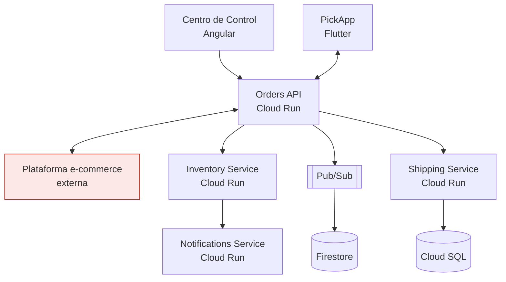

# Bonus. Análisis de arquitectura y riesgos

## B.1 Riesgos de calidad

| Riesgo | Descripción | Prob. | Impacto | Prueba que lo detectaría | Mitigación |
|---|---|---|---|---|---|
| **R1. Asignación duplicada por concurrencia** | Dos supervisores (o reintentos de la app) asignan el mismo pedido; sin bloqueo transaccional ambos ganan | Alta | Alto | Prueba de concurrencia (`threading.Barrier`), integración contra Cloud SQL real, k6 con colisiones | Bloqueo por fila / `UNIQUE(order_id)` en asignaciones activas, idempotency key, respuesta 409 |
| **R2. Reserva de stock inconsistente** | orders-api confirma el pedido antes de que inventory-service reserve; o el mensaje Pub/Sub se pierde/duplica (entrega *at-least-once*) → se procesan pedidos sin stock | Alta | Alto | Integración con emulador Pub/Sub (mensajes duplicados, desordenados, consumidor caído), contract test del evento, E2E pedido sin stock | Patrón **Saga/outbox**, consumidores idempotentes (dedupe por `eventId`), *dead-letter topic* + alertas, estado `PENDING_RESTOCK` |
| **R3. Dependencia síncrona en cascada** | orders-api llama síncronamente a inventory/shipping; si uno se degrada, orders-api agota hilos/conexiones y devuelve 500 (Escenario 1) | Media | Alto | Pruebas de resiliencia/caos (latencia inyectada, inventory caído), carga y estrés, tests de timeouts | Timeouts cortos + *retries* con *backoff* y *jitter*, **circuit breaker**, *bulkheads*, degradación elegante, mover a asíncrono donde se pueda |
| **R4. Ruptura de contratos** | Cambio en la API rompe la app Flutter ya instalada (no todos actualizan), o el e-commerce externo cambia su API/webhook | Media | Alto | **Contract testing** (Pact), pruebas de compatibilidad con versiones N-1 de la app, monitoreo sintético del e-commerce | Versionado de API (`/v1`, `/v2`), *can-i-deploy* en el pipeline, campos opcionales/aditivos, *tolerant reader* |
| **R5. Estado en tiempo real desincronizado** | Firestore (dashboards) se actualiza por eventos; si falla la Cloud Function o el evento llega tarde, el dashboard muestra datos viejos | Alta | Medio | E2E con verificación de propagación (latencia evento → Firestore < 5 s), integración con emulador de Firestore, monitoreo del *backlog* | Métrica y alerta de *lag*, reconciliación periódica Firestore ↔ Cloud SQL, indicador "última actualización" en la UI |
| **R6. Seguridad del borde** | Orders API expuesta a PickApp, Centro de Control y e-commerce: tokens, roles, IDOR entre almacenes, webhooks sin firma | Media | Alto | Suite de seguridad (authz por almacén, tokens), DAST (ZAP), pentest (Burp), validación de firma de webhooks | Gateway/IAP, OAuth2 con *scopes* por cliente, validación de HMAC en webhooks, Cloud Armor (rate limit/WAF) |
| **R7. App mobile con conectividad intermitente** | Almacenes con Wi-Fi inestable: escaneos perdidos o confirmaciones duplicadas | Alta | Medio | Pruebas mobile con red degradada (Appium `network_connection`), modo avión durante la confirmación | Cola local *offline-first*, reintentos idempotentes, sincronización con resolución de conflictos |
| **R8. Datos y migraciones** | Migraciones de Cloud SQL incompatibles con la versión anterior impiden el rollback | Baja | Alto | Pruebas de migración en staging con copia anonimizada, prueba de rollback | *Expand/contract*, migraciones versionadas y reversibles |

## B.2 Puntos de falla y estrategia de contract testing

**Puntos de falla entre componentes:** (1) PickApp ↔ Orders API (red móvil, versiones viejas de la app, auth);
(2) Centro de Control ↔ Orders API; (3) Orders API ↔ e-commerce (sistema externo, SLA ajeno, cambios sin aviso,
webhooks); (4) Orders API → Pub/Sub → consumidores (esquema, duplicados, orden, *dead letters*); (5) Orders API ↔
inventory/shipping (síncrono: latencia en cascada); (6) Pub/Sub → Cloud Functions → Firestore (lag); (7) servicios ↔ Cloud SQL.

| Contrato | Tipo | Herramienta | Cómo |
|---|---|---|---|
| **PickApp ↔ Orders API** | HTTP, **consumer-driven** | **Pact** (`pact_dart`/`pact-python` o Pact JS) + **Pact Broker** | Las pruebas de la app (consumidor) generan el pact con las interacciones que usa (assign, listar pedidos, confirmar); orders-api (proveedor) lo **verifica en su PR** usando *provider states* ("pedido ORD-1 listo para asignar"). `can-i-deploy` impide desplegar un proveedor que rompa **cualquier versión de la app aún en uso** (se etiquetan las versiones de la app publicadas en tiendas). |
| **Orders API ↔ e-commerce (externo)** | HTTP con tercero que **no ejecutará** nuestras pruebas | **Pact bidireccional** (*bi-directional contract testing*) o **Schemathesis** contra la especificación OpenAPI del proveedor + **mocks** (WireMock) en integración | Se obtiene/pacta su OpenAPI; nuestro consumidor genera pacts que se **comparan contra esa especificación**; además pruebas de contrato programadas contra su *sandbox* (detectan cambios no anunciados) y monitoreo sintético. Para los webhooks que **nos** envían: validar con JSON Schema y firma. |
| **Orders API ↔ Pub/Sub (eventos)** | Mensajería asíncrona | **Pact message contracts** o **JSON Schema/Avro** registrado en **Pub/Sub Schemas** | Cada consumidor (inventory, notifications) publica sus expectativas del evento `order.assigned`; el productor verifica que los mensajes que genera cumplen. Pub/Sub Schemas rechaza mensajes inválidos en el *topic*. Versionado del evento (`eventVersion`), cambios sólo aditivos; los incompatibles van a `v2` con convivencia. **Implementado:** `contracts/order_assigned_event.schema.json` + `tests/contract/test_contracts.py`. |

**¿Por qué Pact?** Es el estándar de *consumer-driven contracts*, soporta HTTP **y mensajes**, tiene librerías para
Dart, JS, Python y JVM (stack heterogéneo: Flutter, Angular, Cloud Run), y el **Pact Broker** aporta la matriz de
compatibilidad y `can-i-deploy` para el pipeline. **Spring Cloud Contract** sólo conviene si todo es JVM/Spring
(*provider-driven*). **Schemathesis** no es contract testing dirigido por el consumidor, sino *property-based testing*
de una especificación OpenAPI: excelente **complemento** para robustez del proveedor y para el sistema externo.

## B.3 Plan de regresión E2E

**Flujos críticos: en cada release (bloqueantes, ~30–45 min automatizados):**
1. Pedido externo → reserva de stock → asignación → escaneo completo → guía generada (domicilio).
2. Recogida en tienda → "Listo para recoger".
3. Rechazo por falta de stock → "Pendiente de resurtido" + notificación al e-commerce.
4. Asignación concurrente / reasignación por supervisor (sin duplicados).
5. Login/autorización por rol y almacén (web + mobile).
6. Dashboard del supervisor refleja la asignación en < 5 s.

**Semanales (o nocturnos, no bloqueantes del release salvo regresión):** gestión de usuarios e insumos, reportes y
dashboards de productividad, alertas y notificaciones (vencimientos/excepciones), casos límite (50 SKUs, sesión
expirada, red intermitente), compatibilidad en la matriz completa de dispositivos y navegadores, impresoras
(manual), soak de rendimiento y DAST completo.

**Priorización de la automatización:** puntaje = **impacto en el negocio × frecuencia de uso × probabilidad de fallo
(historial de defectos)**, ajustado por estabilidad de la funcionalidad y costo de automatizar. Orden: (1) API de los
flujos críticos (barata y estable), (2) contratos entre servicios, (3) UI web del supervisor, (4) mobile happy paths,
(5) casos límite y negativos, (6) módulos de bajo riesgo. Cada defecto escapado a producción genera su test de regresión.

## B.4 Estrategia integral para reducir defectos en producción

| Palanca | Acciones concretas |
|---|---|
| **Shift-left testing** | QA en el refinamiento (*three amigos*) con criterios de aceptación verificables y ejemplos (BDD); *Definition of Done* con pruebas unitarias + contrato; pruebas de API automatizadas en el mismo PR de la funcionalidad; SAST/SCA y lint en *pre-commit* y PR; ambientes efímeros por PR en Cloud Run (revisión con *tag*) para probar antes del merge |
| **Feature flags para releases graduales** | Toda funcionalidad nueva detrás de un flag (Firebase Remote Config / LaunchDarkly / Unleash); activación por almacén piloto → región → todos; *kill switch* para apagar sin desplegar; probar ambos estados del flag en CI; limpieza de flags viejos (deuda técnica) |
| **Monitoreo sintético en producción** | Journeys automatizados cada 5 min (login, consultar pedidos, asignar un pedido de prueba marcado como sintético y revertirlo) desde varias regiones con Cloud Monitoring *synthetic monitors* (Playwright/Node); uptime checks por servicio; alertas por SLO y por métricas de negocio (asignaciones/min) |
| **Pruebas en ambientes pre-productivos** | Staging con **paridad** con producción (misma infraestructura como código en Terraform, mismas versiones, datos anonimizados representativos); regresión E2E, rendimiento, DAST y UAT en RC; despliegue canary + rollback automático; *chaos testing* en staging (latencia en inventory, caída de Pub/Sub) |
| **Code review con perspectiva de QA** | Checklist en la plantilla de PR: ¿tiene tests al nivel correcto? ¿casos negativos y límites? ¿idempotencia y concurrencia en escrituras? ¿manejo de timeouts/reintentos? ¿logs estructurados con `trace` y sin datos sensibles? ¿cambios de contrato versionados? ¿`data-testid`/Semantics en UI nueva? ¿migraciones reversibles? ¿flag para la funcionalidad?; CODEOWNERS incluye QA en `tests/`, `contracts/` y workflows; *quality gates* como *required checks* |
| **Aprendizaje continuo** | Postmortem sin culpables de cada defecto escapado → test de regresión + acción preventiva; seguimiento mensual de defect leakage, change failure rate y MTTR |
